# Name 廖元宏 (Andrew Liao) ID 102061137

#Project 4 / Face Detection with a Sliding Window

## Overview
Learn how to implement object detection, face detection in this project, including every critical component through the whole pipeline process.

## Implementation
1. <b>Functions</b>
  * <b>Positive instances features extraction</b>
<p>Compute HoG features of each positive instance, the code has been implemented in `get_positive_features.m `.</p>
  ```
  function features_pos = get_positive_features(train_path_pos, feature_params)
  
      image_files = dir( fullfile( train_path_pos, '*.jpg') ); %Caltech Faces stored as .jpg
      num_images = length(image_files);
      features_pos = zeros(num_images, (feature_params.template_size / feature_params.hog_cell_size)^2 * 31 );
    
      for ii = 1:num_images
          if mod(ii, round(.1*num_images)) == 0
              fprintf('Extract %d images features...\n', ii);
          end
          im = vl_imreadgray( fullfile( train_path_pos, image_files(ii).name ) );
          if sum(size(im) ~= feature_params.template_size) > 0
              im = imresize(im, feature_params.template_size*[1 1]);
          end
          feats = vl_hog(single(im), feature_params.hog_cell_size);
          features_pos(ii, :) = feats(:)';
      end

  end
  ```
  * <b>Negative instances features extraction</b>
<p>Compute HoG features of a certain number of negative instances, the code has been implemented in `get_random_negative_features.m`.</p>

      <p>Procedure: <br/> 1) calculate how many samples we need to extract each image <br/> 2) randomly choose n feasible positions image by image <br/> 3) compute their HoG features respectively </p>
    ```
  function features_neg = get_random_negative_features(non_face_scn_path, feature_params, num_samples)
  
      image_files = dir( fullfile( non_face_scn_path, '*.jpg' ));
      num_images = length(image_files);
      nSamplesPerImg = ceil(num_samples/num_images); % <-- Step(1)
      features_neg = zeros(num_samples, (feature_params.template_size / feature_params.hog_cell_size)^2 * 31 );
      sample_cnt = 0;
    
      for ii = 1:num_images
          if mod(ii, round(.1*num_images)) == 0
              fprintf('Extract %d images features...\n', sample_cnt);
          end
          im = vl_imreadgray( fullfile( non_face_scn_path, image_files(ii).name ) );
          im = single(im);
          pointBound = size(im) - feature_params.template_size + 1;
          for jj = 1:nSamplesPerImg % <------------------- Step(2)(3)
              x_pos = randi([1 pointBound(2)], 1);
              y_pos = randi([1 pointBound(1)], 1);
              hogFeature = vl_hog( ... 
                  im(y_pos:y_pos+feature_params.template_size-1, x_pos:x_pos+feature_params.template_size-1), ... 
                  feature_params.hog_cell_size);
              sample_cnt = sample_cnt + 1;
              if sample_cnt > num_samples
                  return;
              else
                  features_neg(sample_cnt, :) = hogFeature(:)';
              end
          end
      end

  end
  ```
  * <b>Detection with sliding window</b>
<p>Use sliding window model to figure out some POSSIBLE tags of faces, the code has been implemented in `run_detector.m`</p>
      <p>Parameters: <br/> 1) overlap rate: overlap ratio between adjacent samples <br/> 2) threshold: trigger score of detection </p>
      <p>Procedure: <br/> 1) Windowing and evaluating each windowed image, then finding out all detections <br/>
    ```
    function [bboxes, confidences, image_ids] = .... 
      run_detector(test_scn_path, w, b, feature_params)
        test_scenes = dir( fullfile( test_scn_path, '*.jpg' ));

        %initialize these as empty and incrementally expand them.
        bboxes = zeros(0,4);
        confidences = zeros(0,1);
        image_ids = cell(0,1);
    
        %initialize parameters
        templateSize = feature_params.template_size;
        cellSize = feature_params.hog_cell_size;
        thres = 1.25;
        overlap = .9;

        overlapInPix = round( (1-overlap) * templateSize );

        for i = 1:length(test_scenes)
      
            fprintf('Detecting faces in %s\n', test_scenes(i).name)
            img = imread( fullfile( test_scn_path, test_scenes(i).name ));
            img = single(img)/255;
            if(size(img,3) > 1)
                img = rgb2gray(img);
            end
        
            bboxes_section = [];
            confidences_section = [];
        
            scale = max( [ 1 ( templateSize*(1-overlap)*19+templateSize )/min(size(img)) ] );
            ratio = ( floor(100*scale/templateSize*min(size(img)))/100 )^.2;
            while floor(min(size(img))*scale) > templateSize
                imgScaled = imresize(img, scale);
                for scanHoriz = 1:floor( (size(imgScaled, 2)-templateSize)/overlapInPix + 1 )
                    for scanVert = 1:floor( (size(imgScaled, 1)-templateSize)/overlapInPix + 1 )
                        startPos = [(scanHoriz-1)*overlapInPix+1 (scanVert-1)*overlapInPix+1];
                        endPos = startPos + templateSize - 1;
                        imgWindowed = imgScaled(startPos(2):endPos(2), startPos(1):endPos(1));
                        imgHog = vl_hog(imgWindowed, cellSize);
                        conf = imgHog(:)' * w + b;
                        if conf > thres
                            curBox = [startPos' endPos'];
                            curBox = round( ( curBox(:)' )/scale );
                            bboxes_section = [bboxes_section; curBox];
                            confidences_section = [confidences_section; conf];
                        end
                    end
                end
                scale = scale / ratio;
            end
        
            boxesArea = zeros(size(bboxes_section, 1), 1);
            for ii = 1:length(boxesArea)
                boxesArea(ii) = computeArea(bboxes_section(ii, :));
            end
            [~, idx] = sort(boxesArea, 'descend');
            bboxes_section = bboxes_section(idx, :);
            confidences_section = confidences_section(idx);
            [bboxes_section idx] = resultsPostProcess(bboxes_section);
            bboxes = [bboxes; bboxes_section];
            confidences = [confidences; ...
                ( confidences_section(idx(:, 1)) + confidences_section(idx(:, 2)) )/2];
            for ii = 1:size(bboxes_section, 1)
                image_ids{length(image_ids)+1} = test_scenes(i).name;
            end
        end
    end
    ```
  2) Results post-processing: merging all boxes which have a large enough overlapped area
  </p>
    ```
  function [bboxes_post idx] = resultsPostProcess(bboxes_pre)
      idx = zeros(size(bboxes_pre, 1)-1, 2);
      bboxes_post = zeros(size(bboxes_pre));
      pattern_cnt = 0;
      for ii = 1:size(bboxes_pre, 1)-1
          if computeArea(bboxes_pre(ii, :)) == 0
              continue;
          end
          pattern_cnt = pattern_cnt + 1;
          bboxes_post(pattern_cnt, :) = bboxes_pre(ii, :);
          idx(pattern_cnt, :) = ii;
          for jj = ii+1:size(bboxes_pre, 1)
              box1 = bboxes_pre(ii, :);
              box2 = bboxes_pre(jj, :);
              [olpArea olpBox unionBox] = boxesOverlapArea(box1, box2);
              if olpArea > 0 && olpArea/min([computeArea(box1) computeArea(box2)]) > .5
                  idx(pattern_cnt, 2) = jj;
                  bboxes_post(pattern_cnt, :) = olpBox;
                  bboxes_pre(ii, :) = olpBox;
                  bboxes_pre(jj, :) = zeros(1, 4);
              elseif olpArea > 0 && olpArea/max([computeArea(box1) computeArea(box2)]) > .5
                  idx(pattern_cnt, 2) = jj;
                  bboxes_post(pattern_cnt, :) = olpBox;
                  bboxes_pre(ii, :) = unionBox;
                  bboxes_pre(jj, :) = zeros(1, 4);
              end
          end
      end
      idx = idx(1:pattern_cnt, :);
      bboxes_post = bboxes_post(1:pattern_cnt, :);
  end

  %   [x_min, y_min, x_max, y_max]
  function [area olpBox unionBox] = boxesOverlapArea(box1, box2)
      if sum( box1(1) >= box2([1 3]) ) == 2 || sum( box2(1) >= box1([1 3]) ) == 2 ... % Not contained
              || sum( box1(2) >= box2([2 4]) ) == 2 || sum( box2(2) >= box1([2 4]) ) == 2
          area = 0;
          olpBox = [];
          unionBox = [];
      else
          olpx_min = max([box1(1) box2(1)]);
          olpy_min = max([box1(2) box2(2)]);
          olpx_max = min([box1(3) box2(3)]);
          olpy_max = min([box1(4) box2(4)]);
          unix_min = min([box1(1) box2(1)]);
          uniy_min = min([box1(2) box2(2)]);
          unix_max = max([box1(3) box2(3)]);
          uniy_max = max([box1(4) box2(4)]);
          area = ( olpx_max-olpx_min ) * ( olpy_max-olpy_min );
          olpBox = [olpx_min, olpy_min, olpx_max, olpy_max];
          unionBox = [unix_min, uniy_min, unix_max, uniy_max];
      end
  end

  function area = computeArea(box)
      area = (box(3)-box(1))*(box(4)-box(2));
  end
    ```
2. <b>Process</b>
  * <b>Training sets construction</b>
  * <b>Training a binary classifier</b>
  * <b>Truncating each image into pieces</b>
  * <b>Template matching and objects detection</b>
  * <b>Output results</b>

## Installation
* [VLFeat 0.9.17 binary package](http://www.vlfeat.org/download.html)

## Results
<center>
<p>
Face template HoG visualization for the starter code. This is completely random, but it should actually look like a face once you train a reasonable classifier.
<p>
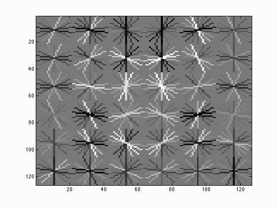
<p>
Precision Recall curve for the starter code.
<p>
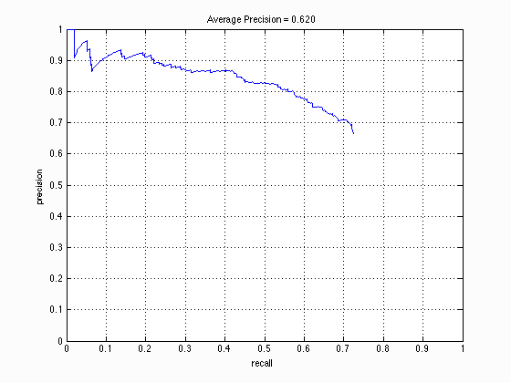
<p>
Example of detection on the test set from the starter code.
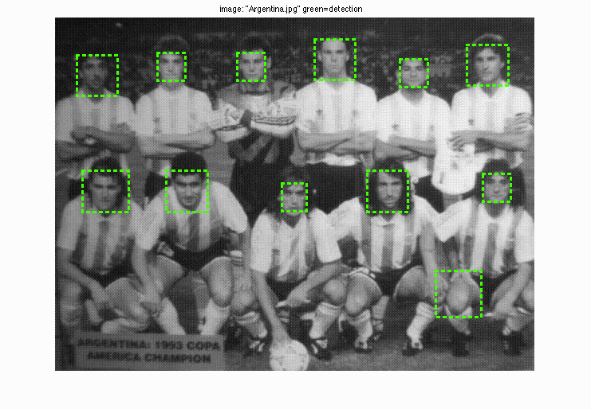
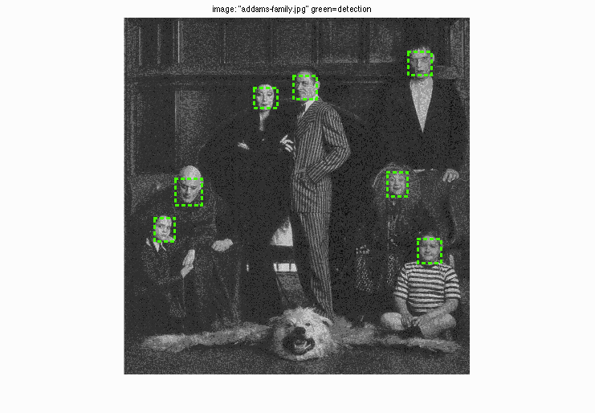
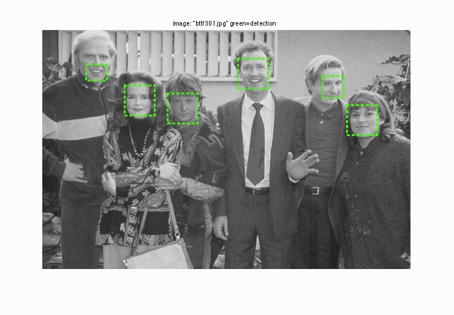
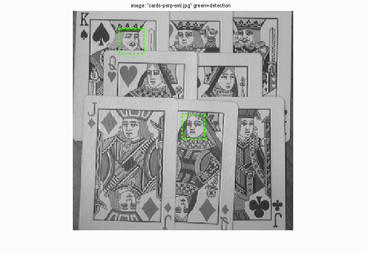
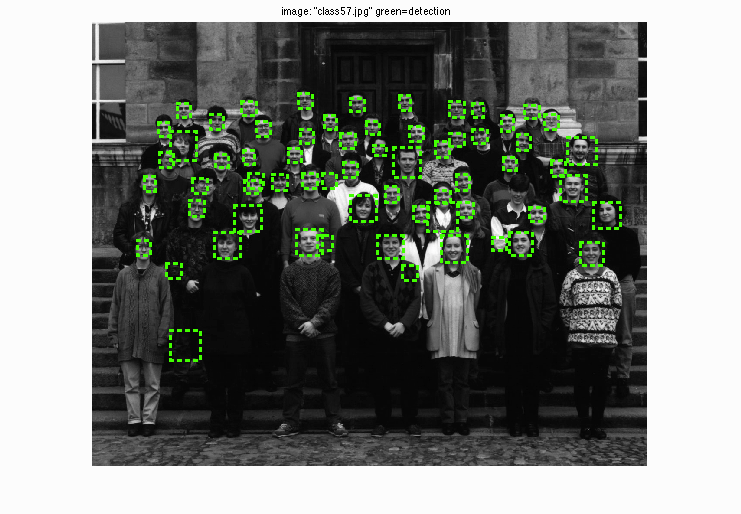
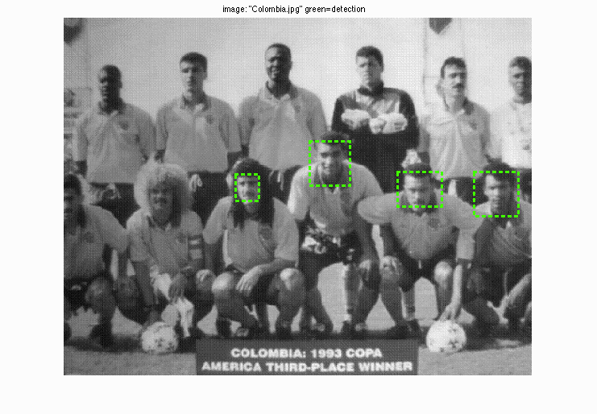
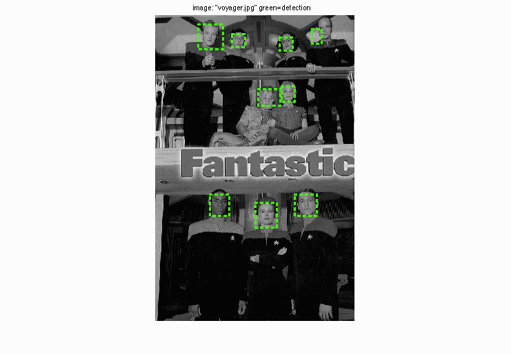
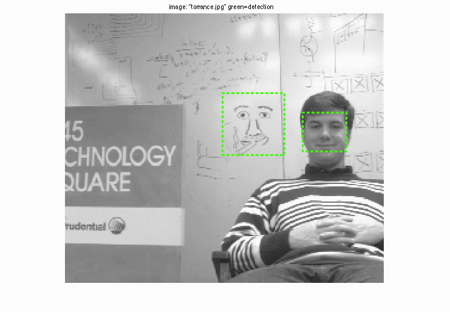
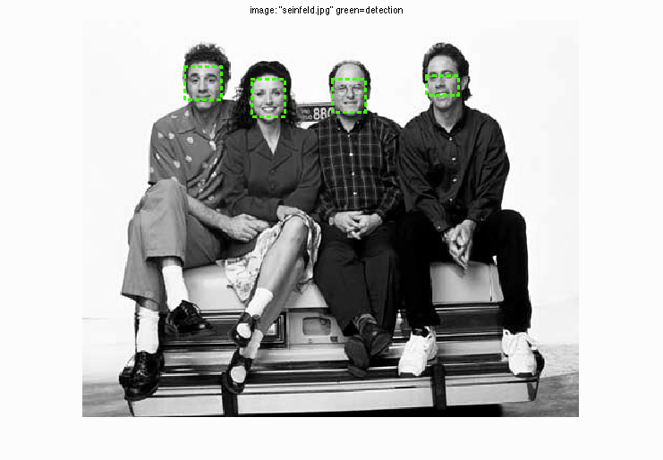
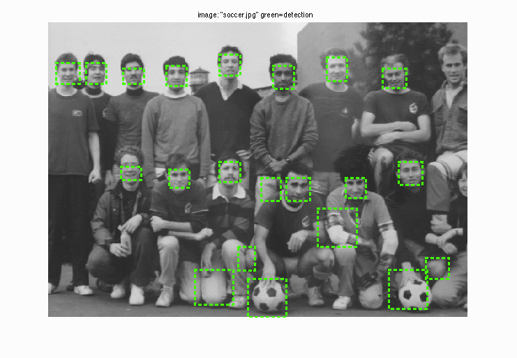
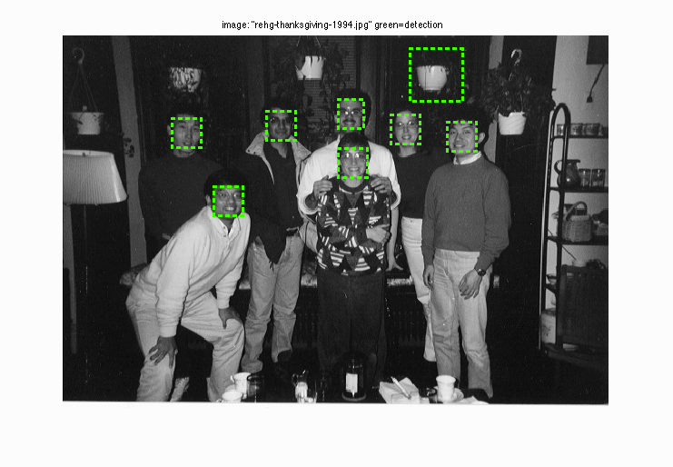
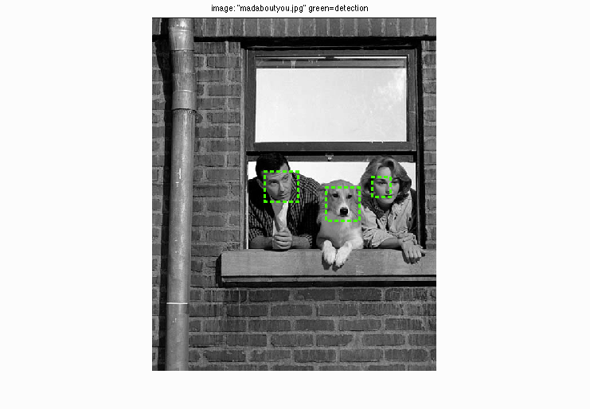
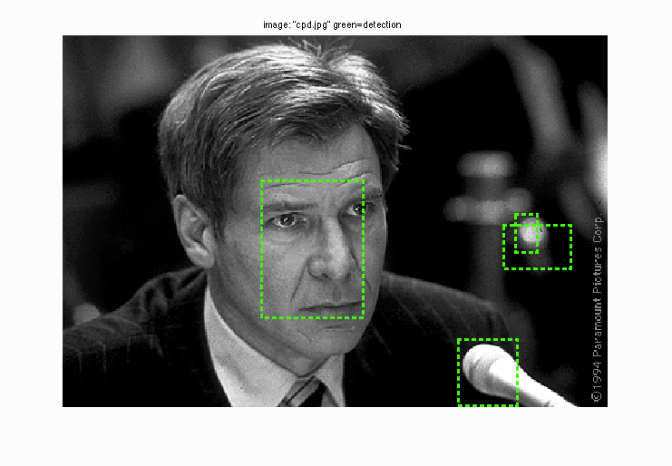

</center>

## Discussions
1. How to determine how densely we sample the windowed image?
<p>In fact, the performance is roughly positively correlated to sample density. However, to reduce time consuming, I choose overlap rate 90%, i.e. 3.6 pixels of template size 36 pixels.</p>
2. Why we need to post-processing the results when detector running?
<p>Because of sampling with large overlap, it is possible that two boxes indicate the same face and two boxes are very close. If we output results without post-processing, there will be multiple boxes that indicate same faces and decrease precision.</p>
3. Detections performance.
<p>When sample resolution is too high, the detector tends to pick up circle-shaped objects such as eyes, ears, and mouths. While the precision is not quite high, the detector always indicates true positive instances and seldom makes mistakes.</p>
