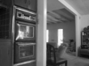
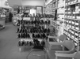
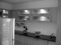
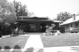

# 廖元宏(Andrew Liao) (102061127)
## Project 3 / Scene recognition with bag of words
I implement a hand-crafted feature extractor(tiny-image, SIFT BoW), and use knn and svm to classify. We do the experiment on 15 scene database. All the images are gray scale to reduce complexity.

## Implementation

- ```get_tiny_images.m```   
This file is to extract the tiny-image feature, which is quite simple. We use the built-in function to resize the image into 16*16 using bilinear interpolation and flatten it.
- ```nearest_neighbor_classify.m```   
Use ```vl_alldist2``` to calculate the l2 distance between every possible pair and choose the closest one as prediction

```matlab
dist = vl_alldist2(train_image_feats', test_image_feats');
[Y,I] = min(dist);
predicted_categories = cell(length(train_labels),1);
for i=1:length(I)
    predicted_categories{i} = train_labels{I(i)};
end
```
- ```build_vocabulary.m```   
Extract the sift feature of the training data and use kmeans cluster the feature and find the center of the cluster as visual words.

```matalb
sift = [];
disp('extracting SIFT...')
for i = 1:length(image_paths)
    img = im2double(imread(image_paths{i}));
    [locations, SIFT_features] = vl_dsift(single(img),'fast','step', 15);
    sift = [sift SIFT_features];
end
disp('kmeans...')
[centers, assignments] = vl_kmeans(double(sift), vocab_size);
vocab = centers';
disp('clustering done')
```

- ```get_bags_of_sifts.m```   
After the clustering, we'll have some visual words. This file is to extract the sift feature and turns it into histogram as BoW features. Here, I use kd-tree to make the process effecient, and ignore the error caused by kd-tree. 

```matlab
kd_tree = vl_kdtreebuild(vocab');
disp('comparing feature...')
for i = 1:length(image_paths)
    img = im2double(imread(image_paths{i}));
    [locations, SIFT_features] = vl_dsift(single(img),'fast','step', 3);
    [I,~] = vl_kdtreequery(kd_tree, vocab', double(SIFT_features));
    tem = histogram(I, vocab_size);
    norm_feat = tem.Values/norm(tem.Values);
    image_feats(i,:) = norm_feat;
end
```
- ```svm_classify.m```   
I create a svm binary classifier, which predict the similarity of the testing image and corresponding label. e.g the probability that the testing image is 'Bedroom'. So I create 15 svm classifier to do the binary classification and pick one that with the higher score as prediction.

```matlab
for c = 1:num_categories
    labels = double(strcmp(train_labels, categories(c))); % N
    labels(labels==0) = -1;
    [W B] = vl_svmtrain(train_image_feats',labels, lambda);
    score = test_image_feats*W+B;
    scores(c,:) = score;
end
```

## Result 

Confusion matrix:   

- tiny-image + knn
<p align="center"> </p>
<br>
Accuracy (mean of diagonal of confusion matrix) is **0.198**
<p>

- BoW of SIFT+ knn
<p align="center"> </p>
<br>
Accuracy (mean of diagonal of confusion matrix) is **0.522**
<p>

- BoW of SIFT+ svm
<p align="center"> </p>
<br>
Accuracy (mean of diagonal of confusion matrix) is **0.652**
<p>

- BoW of SIFT representation + linear SVM classifier, I have tune lambda from 0.1 ~ 1e-06:
	- lambda = 0.1, acc = **0.469**
	- lambda = 0.01, acc = **0.512**
	- lambda = 0.001, acc = **0.626**
	- lambda = 0.0001, acc = **0.669**
	- lambda = 0.00001, acc = **0.652**
	- lambda = 0.000001, acc = **0.654**

<center>
<p>
<table border=0 cellpadding=4 cellspacing=1>
<tr>
<th>Category name</th>
<th>Accuracy</th>
<th colspan=2>Sample training images</th>
<th colspan=2>Sample true positives</th>
<th colspan=2>False positives with true label</th>
<th colspan=2>False negatives with wrong predicted label</th>
</tr>
<tr>
<td>Kitchen</td>
<td>0.610</td>
<td bgcolor=LightBlue></td>
<td bgcolor=LightBlue></td>
<td bgcolor=LightGreen></td>
<td bgcolor=LightGreen></td>
<td bgcolor=LightCoral><br><small>LivingRoom</small></td>
<td bgcolor=LightCoral><br><small>InsideCity</small></td>
<td bgcolor=#FFBB55><br><small>LivingRoom</small></td>
<td bgcolor=#FFBB55><br><small>Store</small></td>
</tr>
<tr>
<td>Store</td>
<td>0.540</td>
<td bgcolor=LightBlue></td>
<td bgcolor=LightBlue></td>
<td bgcolor=LightGreen></td>
<td bgcolor=LightGreen></td>
<td bgcolor=LightCoral><br><small>LivingRoom</small></td>
<td bgcolor=LightCoral><br><small>InsideCity</small></td>
<td bgcolor=#FFBB55><br><small>Industrial</small></td>
<td bgcolor=#FFBB55><br><small>InsideCity</small></td>
</tr>
<tr>
<td>Bedroom</td>
<td>0.530</td>
<td bgcolor=LightBlue></td>
<td bgcolor=LightBlue></td>
<td bgcolor=LightGreen></td>
<td bgcolor=LightGreen></td>
<td bgcolor=LightCoral><br><small>LivingRoom</small></td>
<td bgcolor=LightCoral><br><small>Store</small></td>
<td bgcolor=#FFBB55><br><small>Industrial</small></td>
<td bgcolor=#FFBB55><br><small>OpenCountry</small></td>
</tr>
<tr>
<td>LivingRoom</td>
<td>0.370</td>
<td bgcolor=LightBlue></td>
<td bgcolor=LightBlue></td>
<td bgcolor=LightGreen></td>
<td bgcolor=LightGreen></td>
<td bgcolor=LightCoral><br><small>Kitchen</small></td>
<td bgcolor=LightCoral><br><small>Office</small></td>
<td bgcolor=#FFBB55><br><small>Store</small></td>
<td bgcolor=#FFBB55><br><small>Kitchen</small></td>
</tr>
<tr>
<td>Office</td>
<td>0.840</td>
<td bgcolor=LightBlue></td>
<td bgcolor=LightBlue></td>
<td bgcolor=LightGreen></td>
<td bgcolor=LightGreen></td>
<td bgcolor=LightCoral><br><small>LivingRoom</small></td>
<td bgcolor=LightCoral><br><small>Kitchen</small></td>
<td bgcolor=#FFBB55><br><small>Kitchen</small></td>
<td bgcolor=#FFBB55><br><small>LivingRoom</small></td>
</tr>
<tr>
<td>Industrial</td>
<td>0.450</td>
<td bgcolor=LightBlue></td>
<td bgcolor=LightBlue></td>
<td bgcolor=LightGreen></td>
<td bgcolor=LightGreen></td>
<td bgcolor=LightCoral><br><small>Bedroom</small></td>
<td bgcolor=LightCoral><br><small>Store</small></td>
<td bgcolor=#FFBB55><br><small>Kitchen</small></td>
<td bgcolor=#FFBB55><br><small>Store</small></td>
</tr>
<tr>
<td>Suburb</td>
<td>0.940</td>
<td bgcolor=LightBlue></td>
<td bgcolor=LightBlue></td>
<td bgcolor=LightGreen></td>
<td bgcolor=LightGreen></td>
<td bgcolor=LightCoral><br><small>OpenCountry</small></td>
<td bgcolor=LightCoral><br><small>Industrial</small></td>
<td bgcolor=#FFBB55><br><small>OpenCountry</small></td>
<td bgcolor=#FFBB55><br><small>InsideCity</small></td>
</tr>
<tr>
<td>InsideCity</td>
<td>0.580</td>
<td bgcolor=LightBlue></td>
<td bgcolor=LightBlue></td>
<td bgcolor=LightGreen></td>
<td bgcolor=LightGreen></td>
<td bgcolor=LightCoral><br><small>Street</small></td>
<td bgcolor=LightCoral><br><small>Highway</small></td>
<td bgcolor=#FFBB55><br><small>Store</small></td>
<td bgcolor=#FFBB55><br><small>TallBuilding</small></td>
</tr>
<tr>
<td>TallBuilding</td>
<td>0.660</td>
<td bgcolor=LightBlue></td>
<td bgcolor=LightBlue></td>
<td bgcolor=LightGreen></td>
<td bgcolor=LightGreen></td>
<td bgcolor=LightCoral><br><small>Store</small></td>
<td bgcolor=LightCoral><br><small>Kitchen</small></td>
<td bgcolor=#FFBB55><br><small>Coast</small></td>
<td bgcolor=#FFBB55><br><small>Industrial</small></td>
</tr>
<tr>
<td>Street</td>
<td>0.620</td>
<td bgcolor=LightBlue></td>
<td bgcolor=LightBlue></td>
<td bgcolor=LightGreen></td>
<td bgcolor=LightGreen></td>
<td bgcolor=LightCoral><br><small>LivingRoom</small></td>
<td bgcolor=LightCoral><br><small>TallBuilding</small></td>
<td bgcolor=#FFBB55><br><small>LivingRoom</small></td>
<td bgcolor=#FFBB55><br><small>Store</small></td>
</tr>
<tr>
<td>Highway</td>
<td>0.730</td>
<td bgcolor=LightBlue></td>
<td bgcolor=LightBlue></td>
<td bgcolor=LightGreen></td>
<td bgcolor=LightGreen></td>
<td bgcolor=LightCoral><br><small>Industrial</small></td>
<td bgcolor=LightCoral><br><small>Industrial</small></td>
<td bgcolor=#FFBB55><br><small>TallBuilding</small></td>
<td bgcolor=#FFBB55><br><small>InsideCity</small></td>
</tr>
<tr>
<td>OpenCountry</td>
<td>0.510</td>
<td bgcolor=LightBlue></td>
<td bgcolor=LightBlue></td>
<td bgcolor=LightGreen></td>
<td bgcolor=LightGreen></td>
<td bgcolor=LightCoral><br><small>Highway</small></td>
<td bgcolor=LightCoral><br><small>Forest</small></td>
<td bgcolor=#FFBB55><br><small>Suburb</small></td>
<td bgcolor=#FFBB55><br><small>Coast</small></td>
</tr>
<tr>
<td>Coast</td>
<td>0.740</td>
<td bgcolor=LightBlue></td>
<td bgcolor=LightBlue></td>
<td bgcolor=LightGreen></td>
<td bgcolor=LightGreen></td>
<td bgcolor=LightCoral><br><small>Bedroom</small></td>
<td bgcolor=LightCoral><br><small>InsideCity</small></td>
<td bgcolor=#FFBB55><br><small>Street</small></td>
<td bgcolor=#FFBB55><br><small>Bedroom</small></td>
</tr>
<tr>
<td>Mountain</td>
<td>0.770</td>
<td bgcolor=LightBlue></td>
<td bgcolor=LightBlue></td>
<td bgcolor=LightGreen></td>
<td bgcolor=LightGreen></td>
<td bgcolor=LightCoral><br><small>Coast</small></td>
<td bgcolor=LightCoral><br><small>Store</small></td>
<td bgcolor=#FFBB55><br><small>Forest</small></td>
<td bgcolor=#FFBB55><br><small>Forest</small></td>
</tr>
<tr>
<td>Forest</td>
<td>0.880</td>
<td bgcolor=LightBlue></td>
<td bgcolor=LightBlue></td>
<td bgcolor=LightGreen></td>
<td bgcolor=LightGreen></td>
<td bgcolor=LightCoral><br><small>Mountain</small></td>
<td bgcolor=LightCoral><br><small>Mountain</small></td>
<td bgcolor=#FFBB55><br><small>Mountain</small></td>
<td bgcolor=#FFBB55><br><small>Coast</small></td>
</tr>
<tr>
<th>Category name</th>
<th>Accuracy</th>
<th colspan=2>Sample training images</th>
<th colspan=2>Sample true positives</th>
<th colspan=2>False positives with true label</th>
<th colspan=2>False negatives with wrong predicted label</th>
</tr>
</table>
</center>

